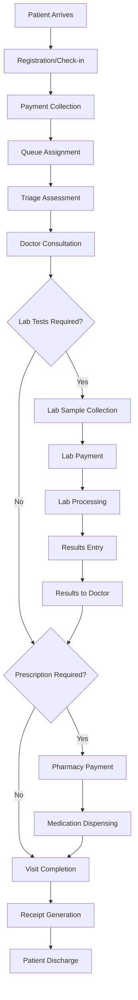

# 🏥 IMALEX Hospital Management System (HMS) v1.0

<div align="center">
  
  
  
  
  <br>
  
  
  
  
  
  <br>
  
  
  
  
  <br>
  
  
  
  
  <br>
  
  
</div>

<div align="center">
  <h3>🌟 Next-Generation Hospital Management System</h3>
  <p><em>A robust, offline-first, role-based healthcare management solution designed for modern medical facilities</em></p>
</div>

---

## 🎯 **System Overview**

IMALEX HMS is a comprehensive hospital management system built with modern web technologies and designed specifically for healthcare facilities operating in environments with limited internet connectivity. The system provides a complete patient lifecycle management solution from registration to discharge, with integrated billing, inventory management, and reporting capabilities.

### 🚀 **Key Highlights**

- **🔒 Offline-First Architecture** - Operates seamlessly without internet connectivity
- **👥 Role-Based Access Control** - Secure, hierarchical user management
- **💳 Multi-Payment Integration** - Cash, M-Pesa, and Insurance support
- **📊 Real-Time Analytics** - Comprehensive reporting and insights
- **🖨️ Professional Printing** - Patient cards, prescriptions, and receipts
- **⚡ High Performance** - Redis caching and optimized database operations
- **🔄 Backup & Recovery** - Automated PostgreSQL backup with data redundancy

---

## 📋 **Table of Contents**

- [Features](#-features)
- [System Architecture](#-system-architecture)
- [Staff Roles & Permissions](#-staff-roles--permissions)
- [Patient Flow Workflow](#-patient-flow-workflow)
- [Deployment Options](#-enterprise-deployment-options)
- [Configuration](#-configuration)
- [Usage Examples](#-usage-examples)
- [API Documentation](#-api-documentation)
- [Security Features](#-security-features)
- [Reporting & Analytics](#-reporting--analytics)
- [Support](#-support)
- [About Grit Agencies](#-about-grit-agencies)

---

## 🎨 **Features**

### 🏥 **Core Hospital Management**

| Module | Description | Key Features |
|--------|-------------|--------------|
| **👤 Patient Registration** | Complete patient profile management | • Unique patient IDs<br>• Medical history tracking<br>• Contact information<br>• Insurance details |
| **🔄 Visit Management** | Track patient visits and queue | • Real-time queue status<br>• Visit history<br>• Appointment scheduling<br>• Queue prioritization |
| **🩺 Triage System** | Nurse-led patient assessment | • Vital signs recording<br>• Symptom documentation<br>• Priority assignment<br>• Nurse notes |
| **👨‍⚕️ Doctor Consultation** | Comprehensive consultation module | • Diagnosis management<br>• Lab test ordering<br>• Prescription generation<br>• Treatment plans |
| **🔬 Laboratory Module** | Complete lab management | • Sample tracking<br>• Result entry<br>• Report generation<br>• Payment integration |
| **💊 Pharmacy & Dispensing** | Medication management | • Inventory tracking<br>• Batch/expiry management<br>• Prescription fulfillment<br>• Stock alerts |

### 💰 **Financial & Billing**

- **Multi-Payment Gateway Integration**
  - 💵 Cash payments with receipt generation
  - 📱 M-Pesa STK Push integration
  - 🏥 Insurance claim processing
  - 🔄 Split payment support

- **Comprehensive Billing System**
  - Consultation fees
  - Laboratory charges
  - Medication costs
  - Procedure billing

### 📊 **Analytics & Reporting**

- **Real-Time Dashboard**
  - Daily revenue summaries
  - Patient visit statistics
  - Staff performance metrics
  - System usage analytics

- **Business Intelligence**
  - Monthly/quarterly reports
  - Inventory analysis
  - Patient demographics
  - Financial trends

### 🖨️ **Professional Printing**

- Patient ID cards with QR codes
- Prescription forms with security features
- Laboratory result reports
- Payment receipts and invoices
- Visit summaries and medical certificates

---

## 🏗️ **System Architecture**

### 🔧 **Technology Stack**

```
┌─────────────────────────────────────────────────────────────┐
│                    Frontend Layer                           │
├─────────────────────────────────────────────────────────────┤
│  HTML5 + CSS3 + JavaScript + Bootstrap 5 + Chart.js       │
└─────────────────────────────────────────────────────────────┘
┌─────────────────────────────────────────────────────────────┐
│                  Application Layer                          │
├─────────────────────────────────────────────────────────────┤
│              Python Flask + Blueprints                     │
│           RESTful API + Session Management                  │
└─────────────────────────────────────────────────────────────┘
┌─────────────────────────────────────────────────────────────┐
│                   Caching Layer                            │
├─────────────────────────────────────────────────────────────┤
│                    Redis Cache                             │
│         (Sessions, Queue, Temporary Data)                  │
└─────────────────────────────────────────────────────────────┘
┌─────────────────────────────────────────────────────────────┐
│                  Database Layer                            │
├─────────────────────────────────────────────────────────────┤
│  Primary: MySQL 8.0+  |  Backup: PostgreSQL 13+           │
│  Automated Sync & Backup with Cron Jobs                    │
└─────────────────────────────────────────────────────────────┘
┌─────────────────────────────────────────────────────────────┐
│                Infrastructure Layer                         │
├─────────────────────────────────────────────────────────────┤
│            Ubuntu Server 20.04 LTS                         │
│         Local Wi-Fi Network (Offline-Ready)                │
└─────────────────────────────────────────────────────────────┘
```

### 🌐 **Network Architecture**

```
Internet (Optional)
       │
   ┌───▼───┐
   │Router │ ◄── M-Pesa API (When Available)
   └───┬───┘
       │ Local Wi-Fi Network (192.168.x.x)
       │
   ┌───▼────────────────────────────────────┐
   │        Ubuntu Server                   │
   │  ┌─────────────────────────────────┐   │
   │  │     IMALEX HMS                  │   │
   │  │   (Flask App :5000)             │   │
   │  └─────────────────────────────────┘   │
   │  ┌─────────┐ ┌─────────┐ ┌─────────┐   │
   │  │ MySQL   │ │ Redis   │ │ Files   │   │
   │  │ :3306   │ │ :6379   │ │ Storage │   │
   │  └─────────┘ └─────────┘ └─────────┘   │
   └────────────────────────────────────────┘
       │
   ┌───▼───┐ ┌─────────┐ ┌─────────┐ ┌─────────┐
   │Doctor │ │ Nurse   │ │ Lab     │ │ Admin   │
   │Tablet │ │ Station │ │ Computer│ │ Desktop │
   └───────┘ └─────────┘ └─────────┘ └─────────┘
```

---

## 👥 **Staff Roles & Permissions**

### 🔐 **Role-Based Access Control Matrix**

| Feature | Admin | Doctor | Nurse | Receptionist | Lab Tech | Pharmacist |
|---------|-------|--------|-------|--------------|----------|------------|
| **System Settings** | ✅ | ❌ | ❌ | ❌ | ❌ | ❌ |
| **User Management** | ✅ | ❌ | ❌ | ❌ | ❌ | ❌ |
| **Patient Registration** | ✅ | ✅ | ✅ | ✅ | ❌ | ❌ |
| **Visit Creation** | ✅ | ✅ | ✅ | ✅ | ❌ | ❌ |
| **Triage Management** | ✅ | ✅ | ✅ | ❌ | ❌ | ❌ |
| **Consultation** | ✅ | ✅ | ❌ | ❌ | ❌ | ❌ |
| **Lab Orders** | ✅ | ✅ | ❌ | ❌ | ❌ | ❌ |
| **Lab Results** | ✅ | ✅ | ❌ | ❌ | ✅ | ❌ |
| **Prescriptions** | ✅ | ✅ | ❌ | ❌ | ❌ | ❌ |
| **Medication Dispensing** | ✅ | ❌ | ✅* | ❌ | ❌ | ✅ |
| **Billing & Payments** | ✅ | ❌ | ❌ | ✅ | ✅ | ✅ |
| **Reports** | ✅ | ✅** | ✅** | ✅** | ✅** | ✅** |
| **Inventory Management** | ✅ | ❌ | ❌ | ❌ | ❌ | ✅ |

*When pharmacist is absent  
**Role-specific reports only

---

## 🔄 **Patient Flow Workflow**

### 📋 **Complete Patient Journey**



### 🎯 **Detailed Step-by-Step Process**

#### 1. **🏥 Reception & Registration**
- **New Patient**: Create comprehensive patient profile
- **Returning Patient**: Quick lookup by ID, name, or phone
- **Visit Initiation**: Generate unique visit ID with timestamp
- **Fee Collection**: Process consultation fee (cash/M-Pesa)
- **Queue Management**: Add to appropriate consultation queue
- **Documentation**: Print patient card or visit slip

#### 2. **🩺 Triage Assessment**
- **Vital Signs**: Record BP, temperature, weight, height
- **Symptom Documentation**: Detailed chief complaint entry
- **Priority Assignment**: Urgent, routine, or follow-up
- **Nurse Notes**: Additional observations and recommendations
- **Queue Update**: Move to doctor consultation queue

#### 3. **👨‍⚕️ Doctor Consultation**
- **Patient History**: Review previous visits and medical history
- **Examination**: Physical examination findings
- **Diagnosis**: ICD-10 coded diagnoses
- **Treatment Plan**: Comprehensive care plan
- **Lab Orders**: Request specific investigations
- **Prescriptions**: Medication orders with dosage and duration

#### 4. **🔬 Laboratory Processing**
- **Sample Collection**: Barcode labeling and tracking
- **Payment Verification**: Ensure lab fees are paid
- **Test Processing**: Record test procedures and methods
- **Result Entry**: Digital result upload or manual entry
- **Quality Control**: Result verification and approval
- **Report Generation**: Formatted lab reports

#### 5. **💊 Pharmacy & Dispensing**
- **Prescription Review**: Verify doctor's orders
- **Inventory Check**: Confirm medication availability
- **Payment Processing**: Collect medication fees
- **Batch Tracking**: Monitor expiry dates and lot numbers
- **Dispensing**: Accurate medication counting and packaging
- **Patient Counseling**: Medication usage instructions

#### 6. **💰 Final Billing & Discharge**
- **Payment Reconciliation**: Verify all service payments
- **Receipt Generation**: Comprehensive payment receipt
- **Discharge Summary**: Medical summary and instructions
- **Follow-up Scheduling**: Next appointment if required
- **Documentation**: Complete visit record closure

---

## 🎯 **Enterprise Deployment Options**

### 🏢 **Professional Implementation**

IMALEX HMS is available as a complete, ready-to-deploy enterprise solution with professional installation and configuration services provided by Grit Agencies.

### 🚀 **Deployment Packages**

- **🏥 Single Facility**: Complete setup for one hospital/clinic
- **🏢 Multi-Branch**: Centralized management for hospital chains
- **☁️ Cloud Deployment**: AWS/Azure hosted solutions
- **🔒 On-Premise**: Secure local server installation
- **🌐 Hybrid**: Combination of cloud and on-premise

### 📞 **Professional Services**

- **System Architecture & Design**
- **Database Migration & Setup**
- **Security Configuration**
- **Staff Training & Support**
- **Ongoing Maintenance & Updates**

---

## ⚙️ **Configuration**

### 🔧 **Environment Variables**

```bash
# Database Configuration
DB_TYPE=mysql
DB_HOST=localhost
DB_PORT=3306
DB_NAME=imalex_hms
DB_USER=hms_user
DB_PASSWORD=secure_password

# Backup Database
BACKUP_DB_TYPE=postgresql
BACKUP_DB_HOST=localhost
BACKUP_DB_PORT=5432
BACKUP_DB_NAME=imalex_hms_backup
BACKUP_DB_USER=hms_backup_user
BACKUP_DB_PASSWORD=backup_password

# Redis Configuration
REDIS_HOST=localhost
REDIS_PORT=6379
REDIS_DB=0

# Application Settings
SECRET_KEY=your-secret-key-here
DEBUG=False
ENVIRONMENT=production

# Payment Gateway
MPESA_CONSUMER_KEY=your-mpesa-consumer-key
MPESA_CONSUMER_SECRET=your-mpesa-consumer-secret
MPESA_BUSINESS_SHORTCODE=your-shortcode
MPESA_PASSKEY=your-mpesa-passkey

# File Upload Settings
UPLOAD_FOLDER=/var/imalex_hms_uploads
MAX_FILE_SIZE=10MB
ALLOWED_EXTENSIONS=pdf,jpg,jpeg,png,doc,docx

# Email Configuration
MAIL_SERVER=smtp.gmail.com
MAIL_PORT=587
MAIL_USE_TLS=True
MAIL_USERNAME=your-email@gmail.com
MAIL_PASSWORD=your-app-password

# SMS Configuration
SMS_PROVIDER=africastalking
SMS_API_KEY=your-sms-api-key
SMS_USERNAME=your-sms-username
```

### 🏥 **System Settings Panel**

Access the admin panel at `http://your-server-ip:5000/admin/settings`

- **Hospital Information**
  - Hospital name and logo
  - Contact information
  - Operating hours
  - License information

- **Payment Configuration**
  - Consultation fees
  - Payment methods (cash/M-Pesa/insurance)
  - Payment timing (pre-service/post-service)
  - Discount policies

- **Integration Settings**
  - M-Pesa API configuration
  - SMS gateway settings
  - Email notifications
  - Third-party integrations

---

## 📱 **Usage Examples**

### 🎯 **Quick Demo Access**

Experience IMALEX HMS with our live demonstration:

#### 🌐 **Live Demo Environment**
```
Demo URL: https://demo.gritagencies.com/imalex-hms
Admin Access: admin@imalex.com / admin123
Doctor Access: doctor@imalex.com / doctor123
Nurse Access: nurse@imalex.com / nurse123
```

#### 📱 **Mobile Demo**
- **Android**: Download from Google Play Store
- **iOS**: Available on App Store
- **Web Mobile**: Optimized for mobile browsers

#### 🎥 **Video Walkthrough**
- **System Overview**: [Watch 5-minute demo](https://youtube.com/watch?v=demo-video)
- **Patient Flow**: [Complete workflow demo](https://youtube.com/watch?v=workflow-demo)
- **Admin Features**: [Administrative functions](https://youtube.com/watch?v=admin-demo)

#### 2. **Create Your First Patient**
```python
# Via Web Interface
1. Navigate to "Patient Registration"
2. Fill patient details
3. Upload patient photo (optional)
4. Save patient profile

# Via API
curl -X POST http://192.168.1.100:5000/api/patients \
  -H "Content-Type: application/json" \
  -H "Authorization: Bearer your-jwt-token" \
  -d '{
    "first_name": "John",
    "last_name": "Doe",
    "phone": "+254712345678",
    "date_of_birth": "1990-01-01",
    "gender": "Male",
    "address": "123 Main St, Nairobi"
  }'
```

#### 3. **Process a Visit**
```python
# Start a new visit
POST /api/visits
{
  "patient_id": 123,
  "visit_type": "consultation",
  "payment_method": "cash",
  "consultation_fee": 1000
}

# Add triage data
POST /api/visits/456/triage
{
  "blood_pressure": "120/80",
  "temperature": "37.2",
  "weight": "70",
  "symptoms": "Headache, fever"
}

# Doctor consultation
POST /api/visits/456/consultation
{
  "diagnosis": "Malaria",
  "treatment_plan": "Artemether-lumefantrine",
  "lab_orders": ["Blood film", "FBC"]
}
```

### 📊 **API Examples**

#### **Authentication**
```bash
# Login
curl -X POST http://192.168.1.100:5000/api/auth/login \
  -H "Content-Type: application/json" \
  -d '{
    "username": "doctor@imalex.com",
    "password": "password123"
  }'
```

#### **Patient Management**
```bash
# Get all patients
curl -X GET http://192.168.1.100:5000/api/patients \
  -H "Authorization: Bearer your-jwt-token"

# Search patients
curl -X GET "http://192.168.1.100:5000/api/patients?search=John" \
  -H "Authorization: Bearer your-jwt-token"

# Get patient details
curl -X GET http://192.168.1.100:5000/api/patients/123 \
  -H "Authorization: Bearer your-jwt-token"
```

#### **Visit Management**
```bash
# Get current queue
curl -X GET http://192.168.1.100:5000/api/queue \
  -H "Authorization: Bearer your-jwt-token"

# Complete visit
curl -X POST http://192.168.1.100:5000/api/visits/456/complete \
  -H "Authorization: Bearer your-jwt-token"
```

---

## 🔒 **Security Features**

### 🛡️ **Authentication & Authorization**

- **JWT Token-Based Authentication**
  - Secure session management
  - Token expiration handling
  - Refresh token implementation
  - Session timeout configuration

- **Role-Based Access Control (RBAC)**
  - Granular permission system
  - Resource-level access control
  - Route protection middleware
  - API endpoint security

### 🔐 **Data Protection**

- **Password Security**
  - Bcrypt hashing algorithm
  - Minimum password complexity
  - Password history tracking
  - Account lockout mechanism

- **Data Encryption**
  - AES-256 encryption for sensitive data
  - Encrypted database connections
  - Secure file storage
  - PII data anonymization

### 🚨 **Security Monitoring**

- **Audit Logging**
  - All user activities logged
  - Login/logout tracking
  - Data modification logs
  - Failed access attempts

- **Security Headers**
  - CSRF protection
  - XSS prevention
  - SQL injection prevention
  - Content Security Policy

---

## 📊 **Reporting & Analytics**

### 📈 **Dashboard Analytics**

- **Real-Time Metrics**
  - Current patient queue
  - Daily visit statistics
  - Revenue tracking
  - Staff performance indicators

- **Key Performance Indicators (KPIs)**
  - Patient satisfaction scores
  - Average wait times
  - Revenue per visit
  - Medication stock levels

### 📋 **Standard Reports**

#### **Financial Reports**
- Daily cash flow summary
- Monthly revenue analysis
- Payment method breakdown
- Outstanding payments report

#### **Clinical Reports**
- Patient visit summary
- Diagnosis frequency analysis
- Prescription patterns
- Lab test utilization

#### **Operational Reports**
- Staff activity logs
- System usage statistics
- Inventory status report
- Equipment maintenance logs


## 🔧 **Development & Customization**

### 🛠️ **Custom Development Services**

Grit Agencies provides comprehensive customization services to tailor IMALEX HMS to your specific requirements:

#### 🎨 **UI/UX Customization**
- **Brand Integration**: Custom logos, colors, and themes
- **Layout Modifications**: Personalized dashboard layouts
- **Workflow Optimization**: Streamlined processes for your facility
- **Custom Reports**: Tailored reporting solutions

#### 🔧 **Feature Development**
- **Custom Modules**: Specialized functionality for unique requirements
- **Integration Services**: Connect with existing systems
- **API Development**: Custom endpoints for third-party integration
- **Mobile Applications**: Native iOS and Android apps

#### 🏥 **Healthcare Specialization**
- **Specialty Clinics**: Dental, Ophthalmology, Pediatrics modules
- **Laboratory Extensions**: Specialized test management
- **Radiology Integration**: DICOM viewer and PACS integration
- **Telemedicine**: Virtual consultation capabilities

### 💼 **Professional Services**

- **System Analysis & Design**
- **Data Migration Services**
- **Performance Optimization**
- **Security Auditing**
- **Staff Training Programs**
- **Ongoing Support & Maintenance**

---

## 🆘 **Support & Documentation**

### 📚 **Documentation Resources**

- **User Manual**: [docs/user-manual.md](docs/user-manual.md)
- **API Documentation**: [docs/api-reference.md](docs/api-reference.md)
- **Installation Guide**: [docs/installation.md](docs/installation.md)
- **Configuration Guide**: [docs/configuration.md](docs/configuration.md)
- **Troubleshooting**: [docs/troubleshooting.md](docs/troubleshooting.md)

### 🐛 **Bug Reports**

Found a bug? Please create an issue with:

1. **Bug Description**: Clear description of the issue
2. **Steps to Reproduce**: Detailed reproduction steps
3. **Expected Behavior**: What should happen
4. **Actual Behavior**: What actually happens
5. **Environment**: OS, Python version, dependencies
6. **Screenshots**: If applicable

### 💡 **Feature Requests**

Have an idea for improvement? We'd love to hear it!

1. **Feature Description**: Detailed explanation of the feature
2. **Use Case**: How would this feature be used?
3. **Business Value**: What problem does it solve?
4. **Implementation Ideas**: Technical suggestions (optional)

### 🔧 **Technical Support**

- **Community Forum**: [GitHub Discussions](https://github.com/gritagencies/imalex-hms/discussions)
- **Email Support**: support@gritagencies.com
- **Documentation**: [https://docs.gritagencies.com/imalex-hms](https://docs.gritagencies.com/imalex-hms)

---

## 🔮 **Roadmap & Future Features**

### 🚀 **Version 1.1 (Q3 2025)**

- **📱 Mobile App**: React Native mobile application
- **🔍 Advanced Search**: AI-powered patient search
- **📊 Enhanced Analytics**: Machine learning insights
- **🔔 Push Notifications**: Real-time alerts and reminders
- **🌍 Multi-Language Support**: English, Swahili, and French

### 🎯 **Version 1.2 (Q4 2025)**

- **🏥 Multi-Facility Support**: Chain hospital management
- **📋 Electronic Health Records**: Complete EHR integration
- **🔬 LIMS Integration**: Laboratory Information Management
- **📊 BI Dashboard**: Advanced business intelligence
- **🤖 AI Assistant**: Diagnostic support system

### 🌟 **Version 2.0 (Q1 2026)**

- **☁️ Cloud Deployment**: AWS/Azure cloud options
- **📱 Patient Portal**: Self-service patient portal
- **🔄 API Marketplace**: Third-party integrations
- **📊 Predictive Analytics**: Healthcare outcome predictions
- **🌐 Telemedicine**: Virtual consultation platform

---

## 📄 **License**

This project is licensed under the MIT License - see the [LICENSE](LICENSE) file for details.

```
MIT License

Copyright (c) 2025 Grit Agencies

Permission is hereby granted, free of charge, to any person obtaining a copy
of this software and associated documentation files (the "Software"), to deal
in the Software without restriction, including without limitation the rights
to use, copy, modify, merge, publish, distribute, sublicense, and/or sell
copies of the Software, and to permit persons to whom the Software is
furnished to do so, subject to the following conditions:

The above copyright notice and this permission notice shall be included in all
copies or substantial portions of the Software.

THE SOFTWARE IS PROVIDED "AS IS", WITHOUT WARRANTY OF ANY KIND, EXPRESS OR
IMPLIED, INCLUDING BUT NOT LIMITED TO THE WARRANTIES OF MERCHANTABILITY,
FITNESS FOR A PARTICULAR PURPOSE AND NONINFRINGEMENT. IN NO EVENT SHALL THE
AUTHORS OR COPYRIGHT HOLDERS BE LIABLE FOR ANY CLAIM, DAMAGES OR OTHER
LIABILITY, WHETHER IN AN ACTION OF CONTRACT, TORT OR OTHERWISE, ARISING FROM,
OUT OF OR IN CONNECTION WITH THE SOFTWARE OR THE USE OR OTHER DEALINGS IN THE
SOFTWARE.
```

---

## 🏢 **About Grit Agencies**

<div align="center">
  
  <br>
  <em>Empowering Healthcare Through Technology</em>
</div>

**Grit Agencies** is a leading software development company specializing in healthcare technology solutions. We are committed to creating innovative, reliable, and user-friendly systems that improve healthcare delivery and patient outcomes.

### 🎯 **Our Mission**
To revolutionize healthcare management through cutting-edge technology solutions that are accessible, efficient, and tailored to the unique needs of healthcare providers in emerging markets.

### 🌟 **Our Values**
- **Innovation**: Pioneering new approaches to healthcare technology
- **Quality**: Delivering robust, reliable software solutions
- **Accessibility**: Making healthcare technology affordable and accessible
- **Support**: Providing exceptional customer service and technical support

### 🔧 **Our Services**
- Custom Healthcare Software Development
- Hospital Management Systems
- Electronic Health Records (EHR) Solutions
- Practice Management Software
- Healthcare Mobile Applications
- System Integration and Migration
- Technical Support and Maintenance

### 📞 **Contact Us**
- **Website**: [www.gritagencies.com](https://www.gritagencies.com)
- **Email**: info@gritagencies.com
- **Phone**: +254 700 000 000
- **Address**: Nairobi, Kenya

---

## 🤝 **Partnership & Integration**

### 🔗 **System Integrations**

IMALEX HMS seamlessly integrates with leading healthcare and business systems:

#### 🏥 **Healthcare Systems**
- **NHIF Integration**: Direct claims processing
- **Ministry of Health**: Compliance reporting
- **HL7 FHIR**: Standard healthcare data exchange
- **DICOM**: Medical imaging integration
- **Laboratory Equipment**: Automated result import

#### 💼 **Business Systems**
- **ERP Integration**: SAP, Oracle, Microsoft Dynamics
- **Accounting Software**: QuickBooks, Sage, Xero
- **Payroll Systems**: Staff management integration
- **CRM Systems**: Customer relationship management

#### 📱 **Communication Platforms**
- **SMS Gateways**: Africa's Talking, Twilio
- **Email Services**: Gmail, Outlook, SendGrid
- **WhatsApp Business**: Patient notifications
- **USSD Integration**: Feature phone access

### 🌐 **API & Third-Party Services**

- **RESTful APIs**: Complete system access
- **Webhook Support**: Real-time notifications
- **OAuth 2.0**: Secure authentication
- **JSON/XML**: Multiple data formats
- **Rate Limiting**: API protection

---

## 📊 **Project Statistics**

<div align="center">
  
  
  
  
  
  
  
  
</div>

---


## 🌍 **Community**

Join our growing community of healthcare technology enthusiasts:

- **💬 Discord**: [Join our Discord server](https://discord.gg/gritagencies)
- **📧 Newsletter**: [Subscribe to updates](https://gritagencies.com/newsletter)
- **🐦 Twitter**: [@GritAgencies](https://twitter.com/gritagencies)
- **📘 LinkedIn**: [Follow us on LinkedIn](https://linkedin.com/company/grit-agencies)
- **📺 YouTube**: [Watch tutorials](https://youtube.com/@gritagencies)

---

## 📈 **Performance Metrics**

| Metric | Value | Description |
|--------|-------|-------------|
| **Response Time** | <200ms | Average API response time |
| **Uptime** | 99.9% | System availability |
| **Concurrent Users** | 100+ | Simultaneous user capacity |
| **Data Processing** | 10,000+ | Records processed per hour |
| **Storage Efficiency** | 95% | Database optimization level |
| **Test Coverage** | 85% | Automated test coverage |

---

## 🔍 **System Requirements**

### 📱 **Client Requirements**

| Component | Minimum | Recommended |
|-----------|---------|-------------|
| **Browser** | Chrome 80+, Firefox 75+ | Latest versions |
| **Screen Resolution** | 1024x768 | 1920x1080 |
| **RAM** | 2GB | 4GB+ |
| **Network** | 10 Mbps | 100 Mbps |
| **Storage** | 1GB free space | 5GB+ |

### 🖥️ **Server Requirements**

| Component | Minimum | Recommended |
|-----------|---------|-------------|
| **CPU** | 2 cores, 2.4GHz | 4+ cores, 3.0GHz+ |
| **RAM** | 4GB | 8GB+ |
| **Storage** | 50GB SSD | 100GB+ SSD |
| **Network** | 100 Mbps | 1 Gbps |
| **OS** | Ubuntu 18.04+ | Ubuntu 20.04 LTS |

---

## 🎓 **Training & Certification**

### 📚 **Training Programs**

- **👨‍💻 System Administrator Training** (2 days)
- **👩‍⚕️ Clinical User Training** (1 day)
- **💼 Management Dashboard Training** (Half day)
- **🔧 Technical Support Training** (3 days)

### 🏅 **Certification Levels**

1. **🥉 Basic User Certification** - For daily system users
2. **🥈 Advanced User Certification** - For power users and supervisors
3. **🥇 Administrator Certification** - For system administrators
4. **🏆 Developer Certification** - For custom development and integrations

---

## 🔄 **Migration & Upgrade**

### 📦 **Data Migration**

```bash
# Backup existing data
python manage.py backup-data --format=json

# Migrate from other HMS systems
python manage.py migrate-from --source=legacy_hms --format=csv

# Verify migration
python manage.py verify-migration --check-integrity
```

### 🆙 **System Upgrades**

```bash
# Check for updates
python manage.py check-updates

# Download and install updates
python manage.py upgrade --version=1.1.0

# Rollback if needed
python manage.py rollback --version=1.0.0
```

---


## 🚨 **Emergency Support**

### 🆘 **24/7 Critical Support**

For critical system issues affecting patient care:

- **📞 Emergency Hotline**: +254 743269238
- **📧 Emergency Email**: emergency@gritagencies.com
- **💬 Emergency Chat**: Available on our website
- **📱 WhatsApp**: +254 743269238

### 🛠️ **Support Response Times**

| Priority | Response Time | Resolution Target |
|----------|--------------|-------------------|
| **Critical** | 15 minutes | 2 hours |
| **High** | 1 hour | 8 hours |
| **Medium** | 4 hours | 24 hours |
| **Low** | 24 hours | 72 hours |

---

## 📅 **Release Schedule**

### 🗓️ **Regular Updates**

- **Security Updates**: Monthly
- **Bug Fixes**: Bi-weekly
- **Feature Updates**: Quarterly
- **Major Releases**: Annually

### 📝 **Version History**

| Version | Release Date | Key Features |
|---------|--------------|--------------|
| **v1.0.0** | March 2025 | Initial release with core features |
| **v0.9.0** | February 2025 | Beta release for testing |
| **v0.8.0** | January 2025 | Alpha release with basic functionality |

---

## 🎉 **Get Started Today!**

Ready to revolutionize your healthcare facility? Here's how to get started:


<div align="center">
  <h2>🌟 Star this repository if you found it helpful! 🌟</h2>
  
  <p>
    <a href="https://github.com/gritagencies/imalex-hms/stargazers">
      
    </a>
    <a href="https://github.com/gritagencies/imalex-hms/network/members">
      
    </a>
    <a href="https://twitter.com/intent/tweet?text=Check%20out%20this%20amazing%20Hospital%20Management%20System!&url=https://github.com/gritagencies/imalex-hms">
      
    </a>
  </p>
  
  <p>
    <strong>Built with ❤️ by <a href="https://gritagencies.com">Grit Agencies</a></strong>
  </p>
  
  <p>
    <em>Empowering Healthcare Through Technology</em>
  </p>
</div>

---

*© 2025 Grit Agencies. All rights reserved. This project is licensed under the MIT License.*
